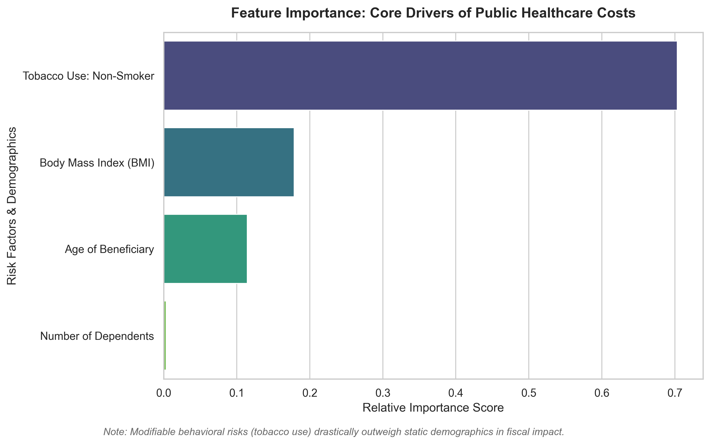

# Healthcare Expenditure & Fiscal Policy Analysis

This repository contains an empirical evaluation of public healthcare costs, aimed at identifying the core drivers of fiscal expenditure. By evaluating both linear and non-linear machine learning frameworks, the analysis delivers evidence-based insights designed to support resource optimization and strategic policy planning.

## Key Focus Areas
* **Objective:** Predicting healthcare charges and isolating the behavioral and demographic risk factors that impact public budgets.
* **Methodology:** Comparative analysis using an Ordinary Least Squares (OLS) Linear Regression and a Decision Tree Regressor. Both models are validated using a 5-fold cross-validation framework to ensure robust, generalizable metrics and eliminate data leakage.
* **Tools Used:** Developed entirely in Python, utilizing pandas and numpy for data pipeline structuring, and scikit-learn for modeling. Visualization is handled via seaborn and matplotlib.

## Visual Insights & Feature Importance
The analysis indicates that modifiable behavioral risks carry significantly more fiscal weight than static demographic traits.

## Strategic Policy Implications
* **Accounting for Non-Linear Risks:** The Decision Tree framework consistently outperformed the linear baseline during cross-validation. This indicates that risk factor interactions within public health datasets are inherently non-linear. For instance, the compounding effect of a high BMI paired with tobacco use creates high-risk cost clusters that simple linear tracking fails to capture.
* **Targeted Resource Allocation:** Relying on static, linear demographic models often leads to under-allocating resources to these critical risk clusters. To maximize fiscal sustainability, public health interventions should pivot toward targeted, preventative behavioral campaigns rather than broad demographic assumptions.
